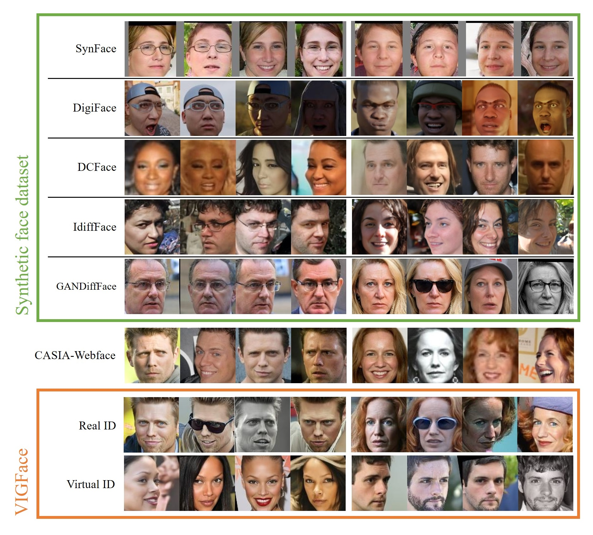

# VIGFace: Virtual Identity Generation for Privacy-Free Face Recognition

Deep learning-based face recognition continues to face challenges due to its reliance on huge datasets obtained from web crawling, which can be costly to gather and raise significant real-world privacy concerns. To address this issue, we propose VIGFace, a novel framework capable of generating synthetic facial images. Our idea originates from pre-assigning virtual identities in the feature space. Initially, we train the face recognition model using a real face dataset and create a feature space for both real and virtual identities, where virtual prototypes are orthogonal to other prototypes. Subsequently, we generate synthetic images by using the diffusion model based on the feature space. The diffusion model is capable of reconstructing authentic human facial representations from established real prototypes, while synthesizing virtual entities from devised virtual prototypes. Our proposed framework provides two significant benefits. Firstly, it allows one to create virtual facial images without concerns about privacy and portrait rights, guaranteeing that the generated virtual face images are clearly differentiated from existing individuals. Secondly, it serves as an effective augmentation method by incorporating real existing images. Further experiments demonstrate the superiority of our virtual face dataset and framework, outperforming the previous state-of-the-art on various face recognition benchmarks.

arXiv: https://arxiv.org/abs/2403.08277

>## VIGFace dataset

Google Drive to download VIGFace(B).

