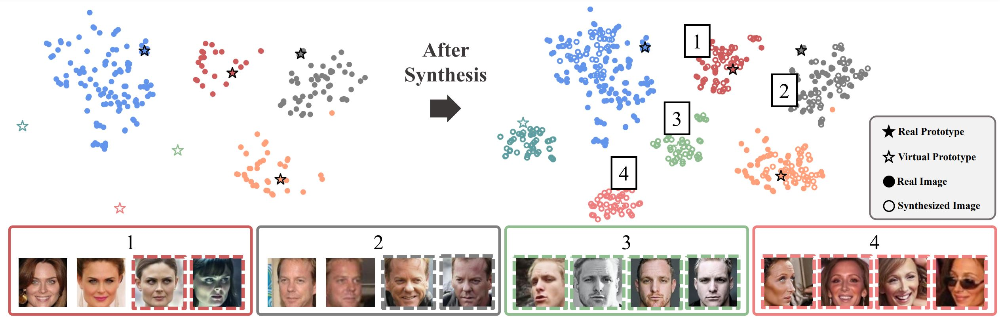
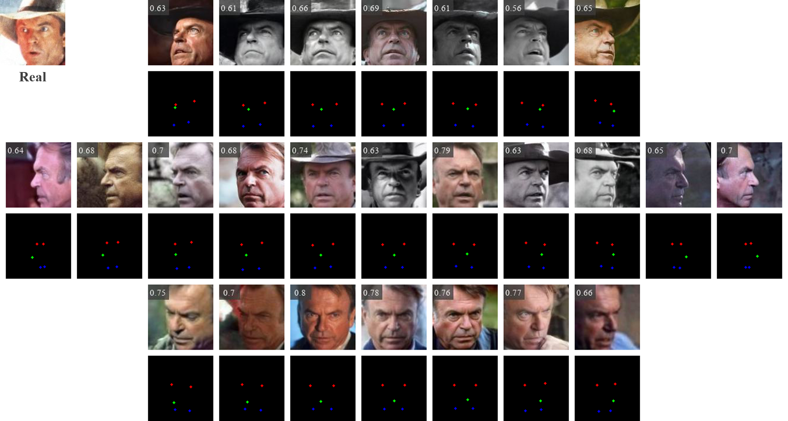

# VIGFace: Virtual Identity Generation for Privacy-Free Face Recognition

Deep learning-based face recognition continues to face challenges due to its reliance on huge datasets obtained from web crawling, which can be costly to gather and raise significant real-world privacy concerns. To address this issue, we propose VIGFace, a novel framework capable of generating synthetic facial images. Our idea originates from pre-assigning virtual identities in the feature space. Initially, we train the face recognition model using a real face dataset and create a feature space for both real and virtual identities, where virtual prototypes are orthogonal to other prototypes. 
Subsequently, we train the diffusion model based on the established feature space, enabling it to generate authentic human face images from real prototypes and synthesize virtual face images from virtual prototypes.
Our proposed framework provides two significant benefits. 
Firstly, it shows clear separability between existing individuals and virtual face images, allowing one to create synthetic images with confidence and without concerns about privacy and portrait rights. Secondly, it ensures improved performance through data augmentation by incorporating real existing images. Extensive experiments demonstrate the superiority of our virtual face dataset and framework, outperforming the previous state-of-the-art on various face recognition benchmarks.

arXiv: https://arxiv.org/abs/2403.08277



>## FR Benchmarks
>
| Method               | Training Dataset | \# of Images (classes × variations) | LFW  | CFP-FP           | CPLFW           | AgeDB           |    CALFW        | Avg.            |
| :------------------- | :--------------- | :------------------------------------------------- | :---------------------: | :--------: | :--------: | :--------: | :--------: | :--------: |
|  |  |  |  |  |  |  |  |  |
| CASIA (Real) | -                | 0\.49M (≈10.5K×47)            | 99\.40                  | 96\.63     | 90\.23     | 94\.68     | 93\.70     | 94\.93     |
| SynFace              | FFHQ             | 0\.5M (10K×50)                         | 91\.93                  | 75\.03     | 70\.43     | 61\.63     | 74\.73     | 74\.75     |
| DigiFace             | 3D modeling      | 0\.5M (10K×50)                         | 95\.40                  | 87\.40     | 78\.87     | 76\.97     | 78\.62     | 83\.45     |
| DCFace               | FFHQ+CASIA       | 0\.5M (10K×50)                         | 98\.55                  | 85\.33     | 82\.62     | 89\.70     | 91\.60     | 89\.56     |
| IDiffFace            | FFHQ             | 0\.5M (10K×50)                         | 98\.00                  | 85\.47     | 80\.45     | 86\.43     | 90\.65     | 88\.20     |
| GANDiffFace          | FFHQ             | 0\.5M (10K×50)                         | 90\.77                  | 73\.27     | 72\.32     | 66\.35     | 74\.68     | 75\.48     |
| ID^3             | CASIA            | 0\.5M (10K×50)                         | 97\.68                  | 86\.84     | 82\.77     | 91\.00     | 90\.73     | 89\.80     |
| CemiFace             | CASIA+WebFace4M  | 0\.5M (10K×50)                         | **99\.03**              | 91\.06     | 87\.62     | 91\.33     | 92\.42     | 92\.30     |
| Arc2Face             | WebFace42M       | 0\.5M (10K×50)                         | 98\.81                  | 91\.87     | 85\.16     | 90\.18     | 92\.63     | 91\.73     |
| HyperFace            | WebFace42M       | 0\.5M (10K×50)                         | 98\.50                  | 88\.83     | 84\.23     | 86\.53     | 89\.40     | 89\.50     |
| HSFace10K            | WebFace4M        | 0\.5M (10K×50)                         | 98\.87                  | 88\.97     | 85\.47     | **93\.12** | **93\.57** | 92\.00     |
| VIGFace(S)     | CASIA            | 0\.5M (10K×50)                         | 99\.02                  | **95\.09** | **87\.72** | 90\.95     | 90\.00     | **92\.56** |
|  |  |  |  |  |  |  |  |  |
| DCFace               | FFHQ+CASIA       | 1\.2M (20K×50+40K×5)       | 98\.58                  | 88\.61     | 85\.07     | 90\.97     | 92\.82     | 91\.21     |
| CemiFace             | CASIA+WebFace4M  | 1\.2M (20K×50+40K×5)       | 99\.22                  | 92\.84     | 88\.86     | 92\.13     | 93\.03     | 93\.22     |
| Arc2Face             | WebFace42M       | 1\.2M (20K×50+40K×5)       | 98\.92                  | 94\.58     | 86\.45     | 92\.45     | 93\.33     | 93\.14     |
| HSFace20K            | WebFace4M        | 1\.0M (20K×50)                         | 98\.87                  | 89\.87     | 86\.13     | 93\.85     | 93\.65     | 92\.47     |
| HSFace300K           | WebFace4M        | 15M (300K×50)                          | 99\.30                  | 91\.54     | 87\.70     | **94\.45** | **94\.58** | 93\.52     |
|  |  |  |  |  |  |  |  |  |
| VIGFace(B)     | CASIA            | 1\.2M (60K×20)                          | **99\.48**              | 97\.07     | 90\.15     | 93\.62     | 92\.88     | 94\.64     |
| VIGFace(L)     | CASIA            | 6\.0M (120K×50)                         | 99\.33                  | **97\.31** | **91\.12** | 93\.82     | 92\.95     | **94\.91** |
```
FR benchmark results trained with various virtual face datasets. All results except for CASIA-WebFace and VIGFace are obtained from the original paper. Trained using IR-SE50 + AdaFace.
```
>## VIGFace example


```
Multiview facial images from real ID
```

```
Multiview facial images from virtual ID
```

>## VIGFace download
Google Drive to download VIGFace(B).
https://drive.google.com/file/d/1sV7CNOwVhoXnq6aw5vD0eeTL9TB3birC/view?usp=drive_link

>## Todo List
- Other datasets will be released soon.
- Inference code will be updated.
